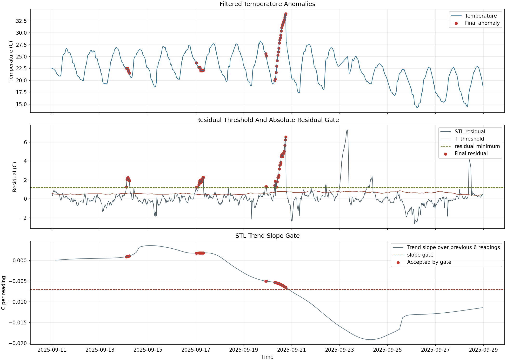

# Grain Sentinel

STL + rolling MAD anomaly detection for timestamped industrial temperature data.

Grain Sentinel is a lightweight, auditable monitoring pipeline for detecting unusual temperature behavior in stored grain, cold storage, server rooms, or any other timestamped temperature stream. The production-facing script reads CSV data, removes normal daily patterns with STL decomposition, detects residual anomalies with a robust rolling MAD threshold, applies a ramp-gating filter to reduce false positives, and writes structured JSONL alerts.

## Highlights

- Input: any CSV with a timestamp column and numeric temperature/sensor column.
- Method: STL decomposition, rolling median absolute deviation, consecutive-point thresholding, and ramp-gating.
- Output: JSONL alert payloads with run metadata, parameters, and final anomaly records.
- Deployment: cron-friendly Python CLI, tested on a small Ubuntu VPS.
- Validation: public weather temperature proxy data with 25 injected slow-heating anomalies.

## Detection Pipeline

```text
CSV temperature data
  -> timestamp parsing and 30-minute resampling
  -> STL decomposition into trend, seasonality, and residuals
  -> rolling MAD residual threshold
  -> consecutive positive residual candidates
  -> ramp-gating filter
  -> JSONL alert payload
```

The detector runs on residuals rather than raw temperature, so normal daily heating and cooling cycles are less likely to become alerts.

## Results

Validation used a public weather temperature dataset as a proxy because public grain-temperature datasets were not suitable. The ground truth contains 25 injected slow 0.5 C/hour heating anomalies, intended to mimic biological heating behavior in stored grain.

| Stage | Recall | Precision | False positives |
| --- | ---: | ---: | ---: |
| Initial STL + MAD | 68.0% | - | - |
| Tuned threshold | 92.0% | 15.5% | 125 |
| Final ramp-gated detector | 88.0% | 52.4% | 20 |

The final filter reduced false positives from 125 to 20 while keeping recall at 88%. The tuned thresholds are data-specific and should be retuned on local industrial sensor history before production use at a new site.

Final plot:



## Quickstart

Create an environment and install dependencies:

```bash
python -m venv .venv
. .venv/bin/activate
pip install -r requirements.txt
```

Recompute the published metrics:

```bash
python scripts/calculate_filtered_metrics.py
```

Run the final detector on the validation input:

```bash
python scripts/detector_filtered.py \
  data/processed/validation_with_injection.csv \
  --timestamp-column timestamp \
  --sensor-column temperature \
  --output-log data/output/alerts.jsonl
```

Run the smoke test:

```bash
python tests/smoke_test.py
```

Expected final metrics:

```text
ground_truth_count = 25
candidate_count = 148
final_flagged_count = 42
true_positives = 22
false_positives = 20
false_negatives = 3
precision = 0.523810
recall = 0.880000
f1 = 0.656716
```

## Deployment

The deployment model is intentionally simple: a Linux cron job runs the detector every 10 minutes against the latest CSV and appends JSONL output to an alert log.

Example cron command:

```cron
*/10 * * * * cd /root/grain-sentinel && ./venv/bin/python scripts/detector_filtered.py --input data/input/latest.csv --timestamp-column timestamp --sensor-column temperature --output-log data/output/alerts.jsonl >> logs/cron.log 2>&1
```

Telegram, email, and dashboard integrations are not implemented in this repository; the JSONL output is designed to be consumed by those downstream systems.

See [DEPLOY.md](DEPLOY.md) for the full VPS setup.

## Repository Structure

```text
grain-sentinel/
  scripts/
    detector_filtered.py          final CLI detector: STL + MAD + ramp gate
    detector_tuned.py             historical tuned detector before ramp gate
    stl_anomaly_detection.py      validation, tuning, and plot generation
    calculate_filtered_metrics.py metric recomputation from audit CSVs
    prepare_audit_validation.py   validation dataset preparation
  data/
    raw/                          public proxy datasets kept for reproducibility
    processed/                    audit files, final anomalies, and metrics
  plots/                          baseline, tuned, and final detector plots
  notebooks/                      exploratory validation notebook
  tests/smoke_test.py             reproducibility smoke test
  DEPLOY.md                       VPS and cron deployment guide
  results.md                      tuning log, metrics, and limitations
```

## Limitations

- Validation uses proxy weather data with injected anomalies, not labelled industrial grain-silo events.
- Ramp-gate thresholds are data-specific and should be retuned for each deployment site.
- The detector assumes enough recent history for STL decomposition and rolling MAD estimation.
- Alert routing is intentionally left to downstream services.

## License

MIT. See [LICENSE](LICENSE).
